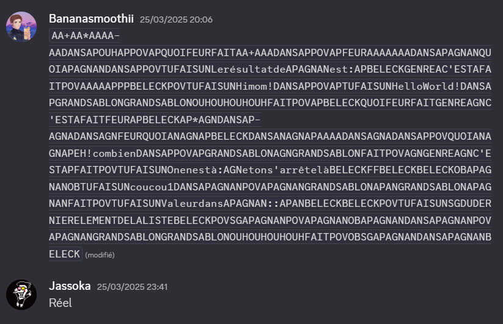

# PAGE officielle d' l'APAGNANGE (raphd était ici)

Voici un exemple compréhensif d'apagnangage

```apagnangage
CRARI factoriel recursif
CRARI AP = factoriel; AGN = compteur max
QUOIFEUR FAIT 
    GENRE AGN C'EST A FAIT
        FEUR AP
    BELECK
    AP * AGN DANS AP
    AGN A - DANS AGN
    FEUR QUOI ANAGNAP
BELECK DANS ANAGNAP
```

## Utilisation
### Lancer un programme
Lancer le fichier "test.apagnan":
```sh
python main.py test.apagnan
```
Lancer un programme directement en ligne de commande:
```sh
python main.py --input "POV TU FAIS UN AAAAAPAAAAGNAAAAAAAN"
```
Désactiver toutes les sécurités (attention: nous déclinons toutes responsabilités quant
à l'encodage des fichiers de sortie et à l'éxecution du bon fichier):
```sh
python main.py --enlève_toutes_les_sécurités --input "POV TU FAIS UN AAAAAPAAAAGNAAAAAAAN"
```

### Introduction
On pourra noter que les espaces et retours à la ligne sont ignorés.
Ainsi, le programme ci-dessus pourra s'écrire:
```apagnangage
QUOIFEURFAITGENREAGNC'ESTAFAITFEURAPBELECKAP*AGNDANSAPAGNA-DANSAGNFEURQUOIANAGNAPBELECKDANSANAGNAP
```
Cela peut être très utile pour envoyer des messages secrets à vos amis:



### Variables
Composées de "AP", "AGN", "AN"
* valide: `APANAGNAN`, `AP`, `APAGNAN`
* non valide: `AAPAGNAN`, `toto`

### Nombres entiers
C'est le nombre de "A"
* 5: `AAAAA`
* 42: `AAAAAAAAAAAAAAAAAAAAAAAAAAAAAAAAAAAAAAAAAA`
* 0: `RIEN` (exception)

### Assignations:
`DANS`

Exemple:
`AAAAA DANS APAN`

### Opérations arithmétiques et logiques
L'ordre des opérateurs et des opérandes n'a aucune importance.
Les opérateurs sont appliqués dans l'ordre dans lequel ils viennent.
Opérateurs:
* `+`
* `-`
* `*`
* `/`
* `C'EST` (égalité)

`AA AA AAAA + * AA - DANS AP` (`AP` = (2 + 2) * 4 - 2 = 14)

### Commentaires
Commencent par `CRARI`
`CRARI Ceci est un commentaire et sera ignoré`

### String (texte)
`TU FAIS UN`:

`TU FAIS UN contenu DANS ANAGN` (`ANAGN` = "contenu")

### Formatage de text
Avec `:`:

`TU FAIS UN la variable APAN vaut :APAN DANS ANAGN` (`ANAGN` = "la variable APAN vaut 5")

### Print (afficher)
`POV`:

`POV TU FAIS UN contenu :APAN` (affiche "contenu 5")

`POV TU FAIS UN contenu DANS APAGNAN` (affiche "contenu" et assigne `APAGNAN` = "contenu")

`POV ANAGN` (affiche "la variable APAN vaut 5")

### Boucles
`GRAND SABLON` compte `GRAND SABLON` nombre d'itération `FAIT` ... `BELECK`:

Répète 4 fois car il y a 4 `OUH`:
```apagnan
GRAND SABLON GRAND SABLON OUH OUH OUH OUH FAIT
    POV TU FAIS UN Ceci sera affiché 4 fois
BELECK
```
Répète infiniment:
```apagnan
GRAND SABLON GRAND SABLON FAIT
    POV TU FAIS UN Ceci sera affiché à l'infini
BELECK
```
Répète `APAN` fois:
```apagnan
GRAND SABLON GRAND SABLON APAN FAIT
    POV TU FAIS UN Ceci sera affiché à l'infini
BELECK
```
Avec une variable pour compter:
```apagnan
GRAND SABLON AP GRAND SABLON APAN FAIT
    POV TU FAIS UN COMPTAGE JUSQU'À :APAN: :AP
BELECK
```

### Incrémentation
`OUH` nom de variable:

`OUH OUH AP` (incrémente `AP` de 2)

### Conditions
`GENRE` condition `FAIT` ... `BELECK`
```apagnan
GENRE AP C'EST AAAA FAIT
    POV TU FAIS UN AP EST ÉGAL À 4
BELECK
```

### Fonctions
`QUOIFEUR FAIT` ... `BELECK DANS` nom de la fonction

ou `QUOIFEUR FAIT` ... `DANS` nom de la fonction

Fonction nommée `APAPAN` qui retourne "Ceci est une fonction":

```apagnan
QUOIFEUR FAIT
    FEUR TU FAIS UN Ceci est une fonction avec comme paramètre APAPANAGNAN = :APAPANAGNAN
BELECK DANS APAPAN
```

**Important: les fonctions n'ont pas de paramètres.** On utilisera donc la convention d'appel suivante:

Pour une fonction nommée _nom_fonction_, les paramètres seront nommées `nom_fonctionAP`, `nom_fonctionAGN`, `nom_fonctionAN`, `nom_fonctionAPAN`, etc.

### Appels de fonction
`QUOI` nom de la fonction:
```apagnan
TU FAIS UN ceci est le paramètre DANS APAPANAGNAN
POV QUOI APAPAN
```

### Définition de liste
`OB` nom de la liste

Définit une liste vide:

```apagnan
OB AGNAGN
```

### Ajout d'éléments à une liste
`OB` ... `DANS` nom liste

```apagnan
OB AAAA DANS AGNAGN
OB TU FAIS UN Ceci est un élément DANS AGNAGN
```

### Retirer un élément d'une liste
`SG` nom liste `LE` index `DANS` variable

`LE` peut être remplacé par `LA` ou `L'`.

Si l'index n'est pas spécifié, on prend le dernier élément de la liste.

```apagnan
SG AGNAGN LE A DANS AP     CRARI AP = AGNAGN[1]
POV AP
POV SG AGNAGN              CRARI print(AGNAGN.pop())
SG AGNAGN
```

### Prendre un élément d'une liste sans l'enlever
`OB SG` ...

Même syntaxe que `SG` mais avec `OB` devant

### Importer des fichiers source
`J'AI LA REF chemin/vers/fichier.apagnan`

importera toutes les fonctions présentes dans fichier.apagnan, et exécutera le code dedans.

__Note :__
    Ne garde pas en mémoire les variables définies.

---
## Pour recompiler le langage

La définition du langage est dans [APAGNANGAGE.g4](./APAGNANGAGE.g4)

```bash
sudo apt install antlr4 # version 4.13.2
antlr4 -Dlanguage=Python3 APAGNANGAGE.g4 -visitor -no-listener
```

En [téléchargeant le jar d'antlr4](https://www.antlr.org/download/antlr-4.13.2-complete.jar)
(notamment pour les utilisateurs de Windows):
```bash
java -cp "Chemin/vers/antlr-4.13.2-complete.jar" org.antlr.v4.Tool -Dlanguage=Python3 APAGNANGAGE.g4 -visitor -no-listener
```
